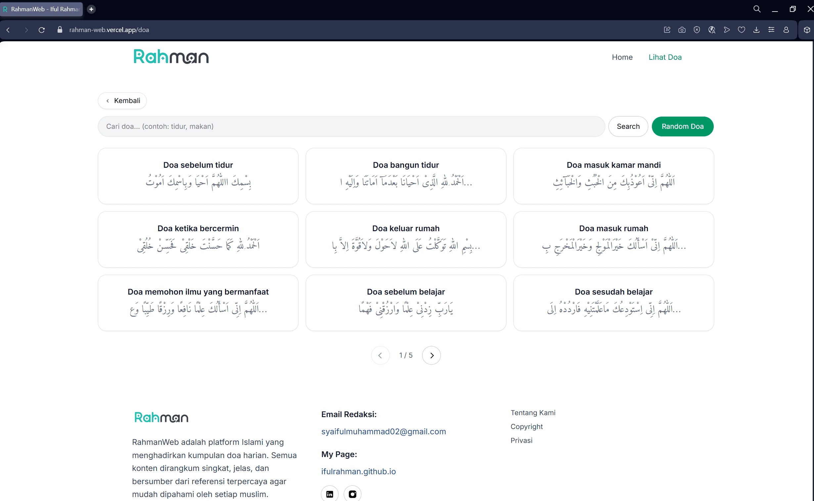

# RahmanWeb

---
## 📖 Overview
**Live Preview:** [https://rahman-web.vercel.app](https://rahman-web.vercel.app)  

**RahmanWeb** is an Islamic web platform that provides a curated collection of daily supplications (*doa harian*).  
Each supplication is presented clearly in Arabic with translations, making it accessible and easy to understand for every Muslim.  

The platform features **search, random doa generation**, offering a seamless and meaningful spiritual experience.  

---

## 📸 Screenshots
  
  
  
  

---

## ✨ Features
| Feature                  | Description                                                                 |
|---------------------------|-----------------------------------------------------------------------------|
| **Daily Doa Collection**  | Authentic supplications with Arabic text and translations.                  |
| **Search Function**       | Find specific supplications easily by keyword.                              |
| **Random Doa Generator**  | Discover a new doa instantly with the random feature.                       |
| **Responsive Design**     | Fully optimized for desktop, tablet, and mobile devices.                    |
| **Lightweight & Fast**    | Built with Vite and React for performance.                                  |

---

## 🔗 API
This project consumes the public **Doa API**:  
➡️ [https://doa-doa-api-ahmadramadhan.fly.dev](https://doa-doa-api-ahmadramadhan.fly.dev)  

---

## 🛠 Tech Stack
### Frontend

- React (Vite) – Lightning-fast development with HMR.
- Tailwind CSS – Utility-first CSS framework for clean and modern design.
- React Router DOM – Seamless page routing.
- AOS (Animate on Scroll) – Smooth animations for an engaging UI.

### Tooling
- Axios – Handles API requests.
- ESLint – Ensures consistent code quality.

---

# React + Vite

This template provides a minimal setup to get React working in Vite with HMR and some ESLint rules.

Currently, two official plugins are available:

- [@vitejs/plugin-react](https://github.com/vitejs/vite-plugin-react/blob/main/packages/plugin-react) uses [Babel](https://babeljs.io/) for Fast Refresh
- [@vitejs/plugin-react-swc](https://github.com/vitejs/vite-plugin-react/blob/main/packages/plugin-react-swc) uses [SWC](https://swc.rs/) for Fast Refresh

## Expanding the ESLint configuration

If you are developing a production application, we recommend using TypeScript with type-aware lint rules enabled. Check out the [TS template](https://github.com/vitejs/vite/tree/main/packages/create-vite/template-react-ts) for information on how to integrate TypeScript and [`typescript-eslint`](https://typescript-eslint.io) in your project.
